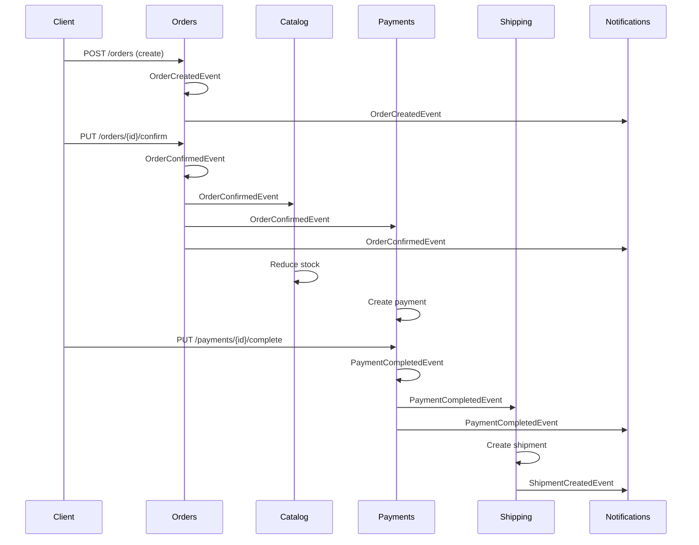

# Modumart Architecture Documentation

## Overview

Modumart is a Spring Boot e-commerce application built using **Spring Modulith** to demonstrate modular architecture and event-driven design patterns. The application is structured as a collection of loosely-coupled modules that communicate through domain events.

## Architecture Principles

- **Modular Architecture**: Each business capability is encapsulated in its own module
- **Event-Driven Communication**: Modules communicate through domain events, not direct API calls
- **Bounded Context**: Each module has a clear business boundary and responsibility  
- **Database per Module**: Each module manages its own data (tables are prefixed by module name)
- **Temporal Decoupling**: Asynchronous event processing provides resilience

## Module Structure

### 1. Catalog Module (`com.negadras.modumart.catalog`)

**Responsibility**: Product catalog management

**Components**:
- `ProductService` - Core business logic for products
- `ProductController` - REST API endpoints  
- `ProductRepository` - Data access layer
- `Product` - Aggregate root

**Published Events**:
- `ProductCreatedEvent` - New product added
- `ProductStockReducedEvent` - Stock reduced after order
- `ProductOutOfStockEvent` - Product out of stock
- `ProductNotFoundEvent` - Product not found

**Event Handlers**:
- `CatalogOrderEventHandler` - Reduces stock when orders are confirmed

**Dependencies**: 
- Listens to: `OrderConfirmedEvent`, `OrderCancelledEvent`
- No direct module dependencies

### 2. Customers Module (`com.negadras.modumart.customers`)

**Responsibility**: Customer management and registration

**Components**:
- `CustomerService` - Customer business logic
- `CustomerController` - REST API endpoints
- `CustomerRepository` - Data access layer  
- `Customer` - Aggregate root

**Published Events**:
- `CustomerRegisteredEvent` - New customer registered

**Event Handlers**: None

**Dependencies**: Independent module with no dependencies

### 3. Orders Module (`com.negadras.modumart.orders`)

**Responsibility**: Order lifecycle management and orchestration

**Components**:
- `OrderService` - Order business logic and event orchestration
- `OrderController` - REST API endpoints
- `OrderRepository` - Data access layer
- `Order` - Aggregate root
- `OrderItem` - Value object

**Published Events**:
- `OrderCreatedEvent` - New order created
- `OrderConfirmedEvent` - Order confirmed (triggers downstream processes)
- `OrderPaidEvent` - Order payment completed
- `OrderShippedEvent` - Order shipped  
- `OrderDeliveredEvent` - Order delivered
- `OrderCancelledEvent` - Order cancelled (triggers stock restoration)

**Event Handlers**: None

**Dependencies**: 
- Uses: Catalog (for product validation), Customers (for customer validation)
- Central orchestration module

### 4. Payments Module (`com.negadras.modumart.payments`)

**Responsibility**: Payment processing and management

**Components**:
- `PaymentService` - Payment business logic
- `PaymentController` - REST API endpoints
- `PaymentRepository` - Data access layer
- `Payment` - Aggregate root

**Published Events**:
- `PaymentInitiatedEvent` - Payment process started
- `PaymentCompletedEvent` - Payment successfully processed
- `PaymentFailedEvent` - Payment failed
- `PaymentRefundedEvent` - Payment refunded

**Event Handlers**:
- `PaymentsOrderEventHandler` - Creates payment when order is confirmed

**Dependencies**:
- Listens to: `OrderConfirmedEvent`

### 5. Shipping Module (`com.negadras.modumart.shipping`)

**Responsibility**: Shipment and logistics management

**Components**:
- `ShippingService` - Shipping business logic
- `ShippingController` - REST API endpoints  
- `ShipmentRepository` - Data access layer
- `Shipment` - Aggregate root

**Published Events**:
- `ShipmentCreatedEvent` - Shipment created
- `ShipmentPreparingEvent` - Shipment being prepared
- `ShipmentShippedEvent` - Shipment dispatched
- `ShipmentInTransitEvent` - Shipment in transit
- `ShipmentOutForDeliveryEvent` - Shipment out for delivery
- `ShipmentDeliveredEvent` - Shipment delivered
- `ShipmentDeliveryFailedEvent` - Delivery failed

**Event Handlers**:
- `ShippingPaymentEventHandler` - Creates shipment when payment is completed

**Dependencies**:
- Listens to: `PaymentCompletedEvent`

### 6. Notifications Module (`com.negadras.modumart.notifications`) 

**Responsibility**: Cross-cutting notification system

**Components**:
- `NotificationService` - Notification business logic
- `NotificationController` - REST API endpoints
- `NotificationRepository` - Data access layer
- `Notification` - Aggregate root

**Published Events**:
- `NotificationCreatedEvent` - Notification created
- `NotificationSentEvent` - Notification sent successfully  
- `NotificationFailedEvent` - Notification sending failed

**Event Handlers**:
- `ModumartEventHandler` - Universal event listener that creates notifications for all domain events

**Dependencies**: 
- Listens to: ALL events from other modules
- Cross-cutting concern with no outbound dependencies

## Event Flow Architecture

### Order Processing Flow

## Spring Modulith Features Used

### 1. Module Structure Verification
- Automatic validation of package boundaries
- Prevention of circular dependencies
- Enforcement of allowed dependencies

### 2. Event Publication and Persistence  
- Guaranteed event delivery with database persistence
- Event replay capabilities
- Completion tracking and cleanup

### 3. Documentation Generation
- Automatic PlantUML diagrams
- AsciiDoc module documentation  
- Component and dependency visualization

### 4. Testing Support
- Module integration tests with `@Scenario`
- Event publication verification
- Architectural compliance tests

## Configuration

### Database Schema
- Each module has its own tables (prefixed with module name)
- Spring Modulith event store tables for event persistence
- Liquibase changesets for schema management

### Event Configuration  
- Event persistence enabled with JDBC store
- Completion update interval: 1 minute
- Event cleanup interval: 1 hour  
- Event retention: 7 days

### Monitoring
- Application-level event monitoring via `EventMonitoringService`
- REST endpoints for event metrics and statistics
- Scheduled logging of event processing statistics

## Generated Documentation

Spring Modulith automatically generates:
- `target/spring-modulith-docs/all-docs.adoc` - Complete architecture documentation
- `target/spring-modulith-docs/components.puml` - System overview diagram  
- `target/spring-modulith-docs/module-*.puml` - Individual module diagrams
- `target/spring-modulith-docs/module-*.adoc` - Module details and API documentation

## Running the Application

1. Start PostgreSQL: `docker-compose up -d`
2. Run application: `mvn spring-boot:run`  
3. Access REST APIs at: `http://localhost:8080`
4. Monitor events at: `http://localhost:8080/api/events/monitoring`

## Testing

- **Architecture Tests**: `ModulithArchitectureTests` - Verifies module structure
- **Boundary Tests**: `ModuleBoundaryTests` - Validates module dependencies  
- **Integration Tests**: `SimpleIntegrationTests` - End-to-end application testing

## Key Benefits Demonstrated

1. **Modularity**: Clear separation of concerns across business capabilities
2. **Evolvability**: Modules can be modified independently  
3. **Testability**: Each module can be tested in isolation
4. **Resilience**: Asynchronous event processing provides fault tolerance
5. **Documentation**: Self-documenting architecture with generated diagrams
6. **Compliance**: Automated verification of architectural rules